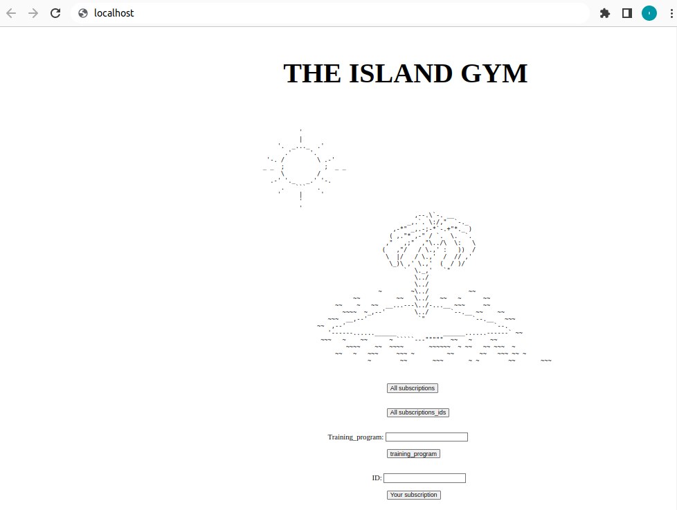

THE ISLAND GYM
===
> CI/CD Project

Hello this project Developed a container that launched a website for a managing subscriptions on a new gym in the city, featuring a simple frontend with severl API's.
This project follow by the CI/CD workflow ensuring that the website is always up-to-date and always work in clean and smoothly with Automated multi-branch Jenkins pipeline

CI/CD workflow:
1. Pull
2. Build
3. Unit-Test
4. End-To-End Test
5. Tagging
6. Publishing
7. Deplyment

Each step in this workflow is designed to ensure that the website is always working as expected ,
and it is buliding on the lastest version of the code that we deploy and guarantee to the GYM staff the best smooth and clean experience to manage subscriptions
